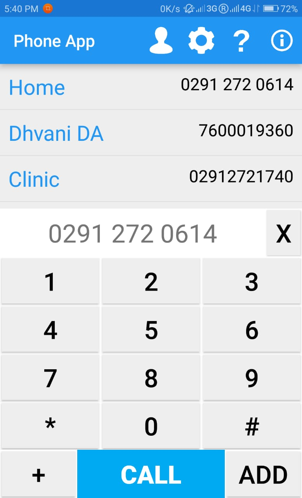
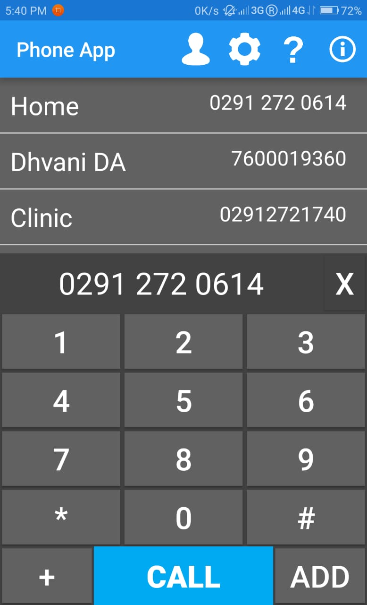
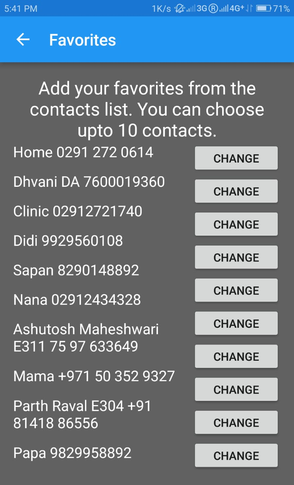
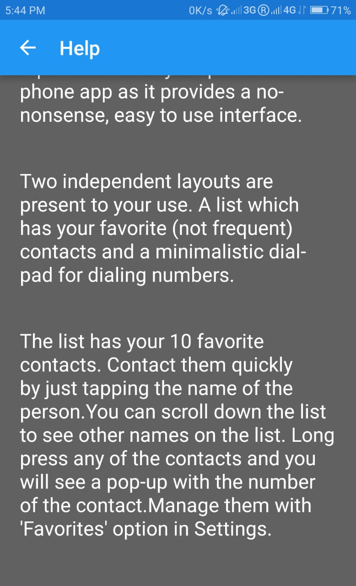

# Phone-App
An Android Application which can replace your default Dialer Application to provide a minimalistic look to the Dialer app.

## Features
1. Favorites
2. Speed Dialing
3. Dark Theme
4. Dual Sim Support
5. All contacts accesible
6. Save new contacts
7. Turn on/off vibration
8. Minimalistic Design

## Description
Phone App provides the user with a really simple interface for dailing. The main screen has 2 sections, the dialpad and the Favorites list. The dialpad is a normal dialpad which has numbers 0-9 and special symbols (+,* and #), along with two buttons, `Call` and `Add`. The `Call` Button will call the number currently in the dialpad, and will prompt the user to select the sim to call from (not in the case when the user has selected a sim as the preferred sim to call from) and `Add` button will add the number in the dialpad to the Contacts list. The dialpad has a textbox which displays the input number, along with a delete button(X). Single tap on the delete button will remove the last digit of the input number. Long pressing will remove the whole number.

Users can assign speed dials to the keys for faster calling. To set the speed dials, go to Settings screen and select `Speed Dial Settings`. Here you can fill the number in the text box in front of the particular number you want to attach it with. and then tap on `Save` to save the list. Also, a user can select the number in the textbox by simply long pressing the number and then selecting `Copy` from the list.

The Favorites list is a list in which you can add upto 10 people which you frequently contact. The list is scrollable and shows the name of the contact and the number. Tapping on any number will copy the number to the tectbox in the dialpad area, giving user the flexiblity to edit the number before dialing or copy the number. To set the favorites, go to Settings screen and select `Favorites`. There you will be shown buttons to change the favorite contact.

To select a contact which is neither in the Favorites nor in the Speed Dial, select the 'Person' icon in the Action Bar, which will then list all the contacts in the Phone. Select any one of them and their main number will be copied in the dialpad.

The application also supports a Dark Theme for the whole application. To enable dark theme, go to Settings screen and select the checkbox for `Dark Mode` and then tap on `Save`, this will enable Dark Theme in the application without restarting the application. Similarly, for turning on/off vibration, go to Settings screen and enable/disable the checkbox for `Vibration` and tap `Save`.

For any further assistance, Help is available in the application itself. Simply select the Help(?) icon in the Action Bar.

## Screenshots
    
